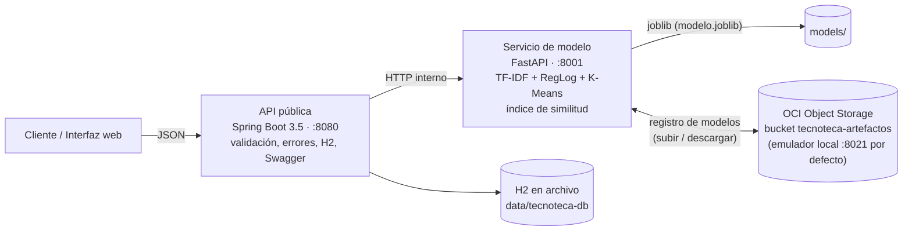

# 📚 Tecnoteca — Organizador inteligente de contenido técnico

**Hackathon ONE G9 · Alura + Oracle**

Tecnoteca recibe contenidos técnicos (descripciones de cursos, tutoriales, apuntes,
documentación) y los convierte en una **base de conocimiento estructurada**: los
clasifica automáticamente en 8 categorías, extrae palabras clave con nombre canónico,
detecta el tema, recomienda contenidos relacionados y permite búsqueda semántica.
Todo el resultado se expone en **JSON** a través de una API REST, con una interfaz
web para registrar, buscar, explorar y cargar lotes CSV, y con la integración de
**OCI Object Storage activa por defecto** (registro de modelos).

```
./run.bash        ←  un solo comando: entorno + datos + modelo + pruebas + build + servicios + demo
```

| | |
|---|---|
| Interfaz web | http://localhost:8080 |
| Swagger de la API pública (Java) | http://localhost:8080/swagger-ui.html |
| Docs del servicio de modelo (Python) | http://localhost:8001/docs |
| Salud | http://localhost:8080/salud |

---

## Arquitectura

Dos servicios, reflejando la división de equipos de la formación ONE
(**Back-End en Java** + **Ciencia de Datos en Python**):



- **API pública (Java, Spring Boot)**: valida la entrada (Bean Validation), maneja los
  errores en JSON consistente, persiste los contenidos en **H2** (JPA) y orquesta al
  servicio de modelo. Es la única cara visible para los clientes.
- **Servicio de modelo (Python, FastAPI)**: carga el artefacto `joblib`, clasifica,
  extrae palabras clave, explica la predicción y mantiene el **índice vectorial** para
  similitud/búsqueda. La fuente de verdad de los contenidos es la base H2: al arrancar,
  el back-end sincroniza el índice (`POST /reindexar`) y lo mantiene al día en cada alta.
- **OCI Object Storage**: registro de modelos (subida al entrenar, descarga al arrancar),
  con *fallback* local si no está habilitado. Ver [Integración con OCI](#integración-con-oci).

## Cómo ejecutar

Requisitos: **Python 3.10+**, **JDK 17+**, **Maven**, `bash` y `curl`
(macOS: `brew install openjdk@21 maven` · Ubuntu: `sudo apt install openjdk-21-jdk maven`).
Opcional: [`uv`](https://docs.astral.sh/uv/) — si está instalado, `run.bash` lo usa para
crear el entorno e instalar dependencias mucho más rápido.

```bash
./run.bash                 # todo: entorno + datos + modelo + pruebas + build + servicios + demo
```

Comandos individuales:

```bash
./run.bash configurar      # entorno de Python (usa uv si está instalado; si no, venv+pip)
./run.bash datos           # genera el dataset propio del equipo (data/*.csv)
./run.bash entrenar        # entrena, serializa el modelo (joblib) y lo sube a OCI
./run.bash probar          # pruebas de Python (pytest, 9 pruebas — incluye la integración OCI)
./run.bash probar-java     # pruebas de Java (mvn test, 9 pruebas)
./run.bash construir       # empaqueta la API (mvn package)
./run.bash servir          # levanta emulador OCI (8021), modelo (8001) y API (8080)
./run.bash demo            # servir + ejecuta los ejemplos de ejemplos/
./run.bash notebook        # ejecuta el notebook de ciencia de datos de punta a punta
./run.bash limpiar         # borra todo lo generado
```

Puertos configurables: `PUERTO_API=8090 PUERTO_MODELO=8011 PUERTO_OCI=8022 ./run.bash servir`.

### Con Docker (opcional)

```bash
./run.bash configurar && ./run.bash datos   # genera la semilla en el host
docker compose up --build                   # modelo + api → http://localhost:8080
```

El modelo se entrena durante la construcción de la imagen (`Dockerfile.modelo`), así el
contenedor arranca listo. *(Probado localmente sin Docker; los Dockerfiles siguen el mismo
flujo que `run.bash`.)*

### CPUs antiguas (x86-64 sin SSE4.2/AVX)

El proyecto funciona en cualquier x86-64 con SSE3 (2005 en adelante, incluidas VMs
`qemu64`/`kvm64` de QEMU/Proxmox). Dos medidas lo garantizan:

- `requirements.txt` fija `numpy<2.4`: desde numpy 2.4 las ruedas oficiales de Linux
  exigen CPUs **x86-64-v2** (SSE4.2/POPCNT) y en equipos anteriores Python muere con
  `Illegal instruction (core dumped)` al importarlas (código 132 en `docker build`).
- Si la CPU no tiene SSE4.2, `run.bash` exporta `OPENBLAS_CORETYPE=PRESCOTT`
  (y `Dockerfile.modelo` lo hace siempre; en otras arquitecturas se ignora) para que
  OpenBLAS use kernels BLAS portables en lugar de autodetectar unos con instrucciones
  que la CPU no soporta.

## La API pública

| Método | Ruta | Descripción |
|---|---|---|
| `POST` | `/contenido` | **(MVP)** Analiza un contenido: categoría + probabilidad + palabras clave + tema + explicación + relacionados. `guardar` (por defecto `true`) lo registra en la base. |
| `POST` | `/contenido/lote` | CSV (`titulo,texto`, máx. 200 filas) procesado por lotes, con errores por fila. |
| `GET` | `/contenidos?categoria=&limite=` | Lista la base de conocimiento. |
| `GET` | `/contenidos/{id}` | Detalle de un contenido. |
| `GET` | `/contenidos/{id}/relacionados?k=` | Recomendación por similitud coseno. |
| `GET` | `/buscar?q=&categoria=&k=` | Búsqueda semántica sobre la base. |
| `GET` | `/categorias` | Categorías del modelo con conteo de contenidos. |
| `GET` | `/salud` | Estado de la API, la base y el servicio de modelo (incluye estado OCI). |

Los ejemplos de abajo son **salidas reales** del sistema (ver `ejemplos/` y
`bash ejemplos/ejecutar_ejemplos.sh`).

### Ejemplo 1 — el caso del enunciado

```bash
curl -X POST http://localhost:8080/contenido -H "Content-Type: application/json" -d '{
  "titulo": "Introducción a Spring Boot",
  "texto": "En este contenido se presentan los conceptos básicos para la creación de APIs REST utilizando Java y Spring Boot."
}'
```

```json
{
  "id": 22,
  "categoria": "Backend",
  "probabilidad": 0.9213,
  "informacion_adicional": ["Spring Boot", "API REST", "Java"],
  "tema": {"id": 7, "etiqueta": "apis, rest, api, consumo"},
  "explicacion": [
    {"termino": "spring", "peso": 0.8656},
    {"termino": "java", "peso": 0.6425},
    {"termino": "spring boot", "peso": 0.4518}
  ],
  "distribucion": {"Backend": 0.9213, "Móvil": 0.0125, "DevOps": 0.0121, "...": "..."},
  "relacionados": [
    {"id": 1, "titulo": "Arquitectura hexagonal en la práctica", "categoria": "Backend", "similitud": 0.2735}
  ]
}
```

La respuesta conserva los campos del enunciado (`categoria`, `probabilidad`,
`informacion_adicional`) y los amplía con tema, explicación del modelo, distribución
de probabilidades y relacionados.

### Ejemplo 2 — clasificación sin guardar (`guardar: false`)

```bash
curl -X POST http://localhost:8080/contenido -H "Content-Type: application/json" -d '{
  "titulo": "Prevención de inyección SQL",
  "texto": "Material de referencia sobre la prevención de inyección SQL: consultas parametrizadas, validación de entrada, uso de ORM y pruebas de seguridad basadas en el OWASP Top 10.",
  "guardar": false
}'
```

```json
{
  "id": null,
  "categoria": "Seguridad",
  "probabilidad": 0.9652,
  "informacion_adicional": ["Inyección SQL", "SQL", "ORM", "OWASP"],
  "relacionados": [
    {"id": 33, "titulo": "Así evitamos la inyección SQL", "categoria": "Seguridad", "similitud": 0.5427},
    {"id": 39, "titulo": "Primeros pasos con el OWASP Top 10", "categoria": "Seguridad", "similitud": 0.278}
  ]
}
```

### Ejemplo 3 — búsqueda semántica

```bash
curl --get http://localhost:8080/buscar --data-urlencode "q=autenticación con tokens en una api" --data-urlencode "k=3"
```

```json
[
  {"id": 3, "titulo": "Autenticación con JWT paso a paso", "categoria": "Backend",
   "similitud": 0.3246, "informacion_adicional": ["JWT", "Node.js", "Express"]},
  {"id": 34, "titulo": "XSS y CSRF explicados con ejemplos", "categoria": "Seguridad",
   "similitud": 0.1257, "informacion_adicional": ["CSRF", "XSS"]}
]
```

### Ejemplo 4 — lote CSV con errores por fila

```bash
curl -X POST "http://localhost:8080/contenido/lote?guardar=false" -F "archivo=@mis_contenidos.csv"
```

```json
{
  "procesados": 1, "errores": 1, "guardado": false,
  "resultados": [
    {"fila": 1, "titulo": "Curso de Kotlin y Android", "categoria": "Móvil", "probabilidad": 0.8943, "error": null},
    {"fila": 2, "titulo": "X", "categoria": null, "probabilidad": null, "error": "el título es demasiado corto"}
  ]
}
```

### Manejo de errores

Todas las respuestas de error comparten formato. Ejemplos reales:

```json
// 400 — validación (texto de 5 caracteres)
{"error": "Entrada inválida",
 "detalles": [{"campo": "texto", "mensaje": "El texto debe tener entre 20 y 50000 caracteres"}]}

// 404
{"error": "No existe el contenido con id 99999"}

// 503 — servicio de modelo caído
{"error": "No fue posible comunicarse con el servicio de modelo"}
```

## Ciencia de datos

Deliverable completo en **`ciencia_datos/notebook_ciencia_de_datos.ipynb`** (ejecutado,
con salidas y gráficos). `ciencia_datos/entrenar.py` es la versión *script* del mismo
pipeline, la que usa `run.bash`.

**Dataset propio** (requisito del hackathon): 1.200 descripciones de contenido técnico
en español generadas por el equipo con un catálogo de ~100 temas y plantillas
(`generar_dataset.py`, semilla fija → reproducible), balanceadas en 8 categorías:
Backend, Frontend, Ciencia de Datos, DevOps, Bases de Datos, Seguridad, Móvil y Cloud.
Además, **48 textos escritos a mano** (`datos_evaluacion.py`) que nunca se usan para
entrenar: miden la generalización real fuera de las plantillas.

**Pipeline**: TF-IDF (1-2 gramas, ~14.000 términos, stopwords en español + palabras de
andamiaje educativo, `strip_accents`) → **Regresión Logística** multiclase
(`class_weight=balanced`) → **K-Means** (k=8) para el tema → **similitud coseno** para
relacionados y búsqueda. Palabras clave con estrategia híbrida: *gazetteer* de ~120
tecnologías con nombre canónico + términos de mayor peso TF-IDF como respaldo.

**Métricas (reproducibles con `./run.bash entrenar`)**:

| Métrica | Valor |
|---|---|
| Exactitud / F1 macro (partición de prueba 20 %) | 1.000 / 1.000 |
| Validación cruzada 5 pliegues (F1 macro) | 1.000 ± 0.000 |
| **Exactitud en los 48 textos manuales (generalización)** | **0.979** (47/48) |
| Silueta K-Means (coseno) | 0.051 |
| Artefacto serializado | `models/modelo.joblib`, 0.2 MB |

Las métricas internas dan ~100 % porque entrenamiento y prueba comparten plantillas de
redacción; por eso **la métrica que reportamos como real es la del conjunto manual**
(0.979 — el único error es «Manejo global de excepciones en una API», un texto
deliberadamente fronterizo). El notebook discute esta limitación con honestidad.

El artefacto (`joblib`) empaqueta vectorizador + clasificador + K-Means + etiquetas de
temas + métricas, y es el mismo formato que producen el script y el notebook.

## Integración con OCI

El proyecto usa **OCI Object Storage como registro de modelos**
(`servicio_modelo/oci_almacen.py`, SDK oficial `oci`) y la integración está
**activa por defecto**:

- `./run.bash` levanta un **emulador local de Object Storage**
  (`servicio_modelo/oci_emulador.py`, puerto 8021) que implementa los endpoints de la
  API nativa que usa el proyecto (namespace, `put_object`, `get_object`, listado). El
  SDK oficial corre **completo** contra él — firma las peticiones, sube y descarga por
  streaming — sin necesitar una tenancy.
- `./run.bash entrenar` **sube** `modelo.joblib` al bucket (lo verás en la salida:
  `OCI: modelo subido al bucket 'tecnoteca-artefactos'...`).
- Al arrancar, si el servicio de modelo no encuentra el artefacto local, lo **descarga**
  del bucket (así una instancia nueva en OCI Compute arranca sin entrenar).
- `GET /salud` reporta el estado (modo, endpoint, namespace, conectado) y la demo lista
  los objetos del bucket. La integración se prueba de punta a punta en
  `pruebas/test_oci_local.py` (subir + descargar + verificación byte a byte con el SDK).

| Modo (`OCI_AUTH`) | Qué hace |
|---|---|
| `local` *(por defecto en run.bash)* | SDK real contra el emulador local (`OCI_ENDPOINT=http://localhost:8021`). |
| `config` | Object Storage **real** con `~/.oci/config` (`OCI_CONFIG_FILE`/`OCI_PROFILE`). |
| `instance_principal` | Desde una instancia de OCI Compute, sin archivo de configuración. |

### Apuntar al Object Storage real de tu tenancy

```bash
# 1. Crear el bucket (una vez, con OCI CLI configurada)
oci os bucket create --compartment-id <OCID_COMPARTIMENTO> --name tecnoteca-artefactos

# 2. Entrenar, subir y servir contra OCI real (sin OCI_ENDPOINT → endpoint oficial)
OCI_AUTH=config ./run.bash
```

Variables adicionales: `OCI_BUCKET` (por defecto `tecnoteca-artefactos`),
`OCI_OBJETO_MODELO` (`modelos/modelo.joblib`), `PUERTO_OCI` (8021) y
`OCI_ENABLED=false` para desactivar la integración por completo.

### Despliegue en OCI Compute (resumen)

1. Instancia **VM.Standard.E2.1.Micro** (Always Free) con Ubuntu; en la VCN, abrir el
   puerto 8080 en la lista de seguridad (y en el firewall de la VM).
2. `sudo apt install -y python3-venv openjdk-21-jdk maven git && git clone <repo> && cd tecnoteca`.
3. `export OCI_ENABLED=true OCI_AUTH=instance_principal OCI_BUCKET=tecnoteca-artefactos`
   y `./run.bash servir` (el modelo se descarga del bucket; para dejarlo como servicio,
   dos unidades `systemd` que ejecuten los mismos comandos de `run.bash servir`, o
   `docker compose up -d`).

## Estructura del proyecto

```
tecnoteca/
├── run.bash                     # orquestador (un comando levanta todo)
├── ciencia_datos/               # equipo de Ciencia de Datos
│   ├── notebook_ciencia_de_datos.ipynb   # deliverable: EDA → modelo → métricas → joblib
│   ├── generar_dataset.py       # corpus propio (plantillas + catálogo, semilla fija)
│   ├── datos_evaluacion.py      # 48 textos escritos a mano (evaluación honesta)
│   ├── entrenar.py              # pipeline productivo (mismo que el notebook)
│   ├── tecnologias.py           # gazetteer de ~120 tecnologías (palabras clave)
│   └── stopwords_es.py          # stopwords normalizadas (español + andamiaje)
├── servicio_modelo/             # API interna de ciencia de datos (FastAPI)
│   ├── main.py                  # /analizar /similares /buscar /indexar /reindexar /salud
│   ├── nucleo.py                # carga del artefacto, predicción, explicación
│   ├── indice.py                # índice vectorial en memoria (similitud coseno)
│   ├── oci_almacen.py           # OCI Object Storage con el SDK oficial (3 modos de auth)
│   └── oci_emulador.py          # emulador local de Object Storage (modo por defecto)
├── api/                         # API pública (Spring Boot 3.5, Java 17)
│   └── src/main/java/com/tecnoteca/api/
│       ├── contenido/           # controlador, servicio, entidad JPA, repositorio, DTOs
│       ├── modelo/              # cliente HTTP del servicio de modelo
│       ├── errores/             # @RestControllerAdvice → errores JSON en español
│       ├── carga/               # semilla inicial + sincronización del índice
│       └── util/                # lector CSV (commons-csv)
│   └── src/main/resources/static/index.html   # interfaz web (vanilla JS)
├── pruebas/                     # pytest: servicio de modelo + integración OCI (9 pruebas)
├── ejemplos/                    # 5 peticiones de ejemplo + script ejecutable
├── data/ · models/              # generados (dataset, semilla, H2, joblib, métricas)
├── Dockerfile.modelo · api/Dockerfile · docker-compose.yml
└── requirements.txt · requirements-notebook.txt
```

## Pruebas

- **Python (9)**: `./run.bash probar` — carga del modelo, ejemplo del enunciado
  (categoría y palabras clave exactas), validaciones 422, flujo indexar → similares →
  buscar con filtro de categoría, e integración OCI de punta a punta (el SDK oficial
  sube y descarga el modelo contra el emulador y se compara byte a byte).
- **Java (9)**: `./run.bash probar-java` — lector CSV (BOM, cabeceras, límites),
  Bean Validation de la entrada, contrato JSON snake_case con el servicio de modelo
  (`MockRestServiceServer`) y traducción de errores.

## Dependencias y versiones (verificadas)

| Componente | Versión |
|---|---|
| Python / Java / Maven | 3.13 y 3.14 (probados; requiere ≥3.10) / OpenJDK 21 (requiere ≥17) / 3.9 |
| scikit-learn · pandas · numpy | 1.9.0 · 3.0.3 · 2.3.5 (`numpy<2.4`: [CPUs antiguas](#cpus-antiguas-x86-64-sin-sse42avx)) |
| FastAPI · uvicorn · pydantic | 0.139 · 0.51 · 2.13 |
| SDK de OCI (`oci`) | 2.182 |
| Spring Boot (web, validation, data-jpa, H2) | 3.5.4 |
| springdoc-openapi · commons-csv | 2.8.9 · 1.11.0 |
| pytest · JUnit 5 | 9.1 · (con Spring Boot) |

## Limitaciones y próximos pasos

- El corpus generado por plantillas infla las métricas internas; el conjunto manual da la
  cifra honesta (0.979). Siguiente paso: reentrenar con los contenidos reales que los
  usuarios registran desde la aplicación.
- TF-IDF no captura sinonimia profunda; para la búsqueda, el paso natural son
  *embeddings* de oraciones (la arquitectura ya lo permite: solo cambia el servicio de modelo).
- Persistencia en H2 por simplicidad del MVP; en producción, Oracle Autonomous Database
  en OCI con el mismo código JPA (cambiar el datasource).

---
*Proyecto del Hackathon ONE G9 — Alura Latam + Oracle. Código en español, igual que su documentación, pensado para el equipo y los evaluadores.*
